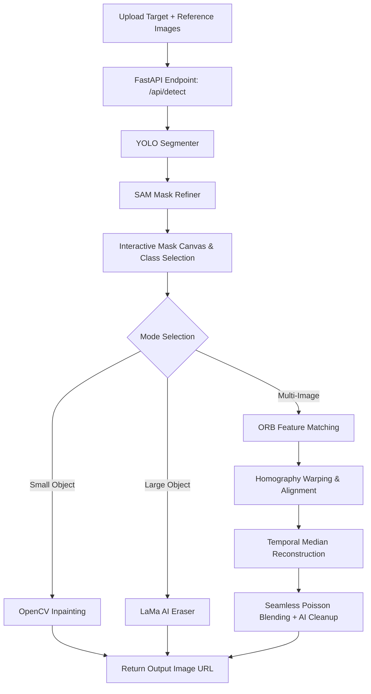

# Advanced Object Removal & Background Reconstruction

A full-stack application for automated and multi-reference object removal from images. It combines the speed of **YOLO (Ultralytics)**, the precision of the **Segment Anything Model (SAM)**, and the robust image processing power of **OpenCV** to seamlessly erase objects.

---

## 🚀 Key Features

*   **Smart Detection**: Powered by YOLO Segmentation (`yolo11n-seg` or `yolov8n-seg`) to automatically identify common objects (people, vehicles, bags, etc.).
*   **Precision Masking**: Optional SAM integration to refine coarse detection masks down to pixel-level accuracy.
*   **AI Eraser**: Advanced Large Mask Inpainting (LaMa) integration for photorealistic removal of large foreground objects.
*   **Single-Image Inpainting**: OpenCV-based Fast Marching (`cv2.INPAINT_TELEA`) and Navier-Stokes (`cv2.INPAINT_NS`) fallback methods.
*   **Multi-Image Background Reconstruction**: Uses keypoint alignment (ORB + Homography) across multiple photographs to reconstruct hidden areas and seamlessly blend them using Poisson image editing (`cv2.seamlessClone`).
*   **FastAPI Backend**: Asynchronous, robust API backend with session-based detection caching.
*   **Modern React Frontend**: A gorgeous, high-fidelity user interface built with Vite, featuring custom interactive canvas overlay, side-by-side comparison slider, and clean stepper progress.

---

## 🛠️ Architecture Overview



---

## 📦 Directory Structure

```
object-removal/
├── app.py                          # FastAPI Server
├── config.py                       # Global Settings & Thresholds
├── requirements.txt                # Python Dependencies
├── README.md                       # Documentation
├── data/                           # Runtime Data Directories (Auto-created)
│   ├── input/                      # Uploaded images
│   ├── masks/                      # Generated mask previews
│   └── output/                     # Final output results
├── models/                         # Local cached models (Auto-downloaded)
├── src/                            # Core Logic
│   ├── detection/yolo_detector.py  # YOLO Segmenter
│   ├── segmentation/sam_segmenter.py # SAM Refinement
│   ├── alignment/image_aligner.py  # ORB Alignment
│   ├── inpainting/                 # AI Inpainting Backend (LaMa)
│   ├── removal/                    # Single/Multi Image Removal Orchestration
│   ├── blending/blender.py         # Poisson, Alpha, and Feature Blending
│   └── pipeline.py                 # Orcherstration Flow
└── frontend/                       # React App
```

---

## ⚙️ Backend Setup & Run

### 1. Prerequisites
Ensure you have **Python 3.10+** installed on your system.

### 2. Install Dependencies
```bash
pip install -r requirements.txt
pip install simple-lama-inpainting  # Required for AI Eraser features
```

### 3. Run FastAPI Server
```bash
python app.py
```
The server will start at `http://localhost:8000`. You can access the auto-generated Swagger API docs at `http://localhost:8000/docs`.

---

## 🎨 Frontend Setup & Run

Please refer to the `frontend/` directory structure and details below for the React application implementation.

### 1. Initialize & Dev Run
To set up and run the Vite-based React application:
```bash
cd frontend
npm install
npm run dev
```
The application will launch on `http://localhost:5173`.
